# 🔷 _linear — MCP Server v2.0 (Multi-Agente)

Servidor MCP para Linear.app, bloqueado al proyecto **`linear_ods`**.  
Versión 2.0 implementa la arquitectura de **orquestación multi-agente** con claim atómico, heartbeat, tool gating, manejo de fallos y traspaso de contexto entre agentes.

> **Regla universal:** Todo problema, feature, bug o mejora que se traiga al proyecto — **sin excepción** — sigue el mismo ciclo documentado abajo: **limpieza** → plan → HTML propuesta → aprobación → `.mjs` → multi-agente (Backlog → Doing → Testing → Done) → HTML resumen. **Primero se limpia** (Linear + carpetas `_linear`); **después** se redacta la propuesta. No importa el dominio (login, indicadores, evidencia, reportes, etc.): el **proceso es siempre el mismo**; solo cambian los issues, archivos y gates que apliquen (BD, BE, FE o una sola capa).

---

## 📁 Estructura

```
_linear/
├── plans/
│   ├── _plantilla_ods.html           ← Plantilla visual ODS (copiar CSS y estructura)
│   ├── plan_sprint_<nombre>.html     ← Fase 2 — propuesta del sprint **activo** (PENDIENTE → APROBADO)
│   └── resumen_sprint_<nombre>.html  ← Fase 6 — cierre del sprint activo (DONE)
├── scripts/
│   ├── sprint_<nombre>.mjs           ← Orquestación Linear del sprint **activo** (Fase 4 — solo tras aprobación)
│   ├── linear-lib.mjs                ← Checklist + estados compartidos (siempre)
│   ├── linear-comment.mjs            ← Comentarios Linear (siempre)
│   ├── linear-update-state.mjs       ← Estados y checklist (siempre)
│   └── resumen_sprint_evidence_section.html  ← Referencia visual de estilo (siempre; no es sprint activo)
├── src/
│   └── index.ts          ← Fuente TypeScript completa
├── dist/
│   └── index.js          ← Compilado listo para usar
├── state/
│   └── agent-claims.json ← Registro local de claims (auto-generado)
├── package.json
├── tsconfig.json
└── README.md
```

---

## ⚙️ Instalación

```bash
cd _linear
npm install
npm run build
```

### 🔑 API key en local (scripts y `npm run dev`)

La key **no va en el código** ni en git. Solo en `_linear/.env`:

```bash
cd _linear
copy .env.example .env    # Windows
# Edita .env y reemplaza lin_api_xxx... por tu Personal API key de Linear
```

Luego puedes correr sin `$env:LINEAR_API_KEY` cada vez:

```bash
node scripts/evaluacion.mjs
node scripts/evaluacion-sync-linear.mjs
```

Si la key anterior se subió a git, **revócala en Linear** y crea una nueva en `.env`.

---

## 🔌 Configurar en Claude Desktop

**macOS:** `~/Library/Application Support/Claude/claude_desktop_config.json`  
**Windows:** `%APPDATA%\Claude\claude_desktop_config.json`

```json
{
  "mcpServers": {
    "linear-ods": {
      "command": "node",
      "args": ["/RUTA/ABSOLUTA/_linear/dist/index.js"],
      "env": {
        "LINEAR_API_KEY": "<tu-api-key-de-linear>",
        "LINEAR_TEAM_NAME": "linear_ods",
        "HEARTBEAT_TTL_MS": "300000"
      }
    }
  }
}
```

> Reemplaza `/RUTA/ABSOLUTA/` con la ruta real. Reinicia Claude Desktop.

---

## 🧰 Herramientas — Referencia completa

### 👤 Equipo / Meta
| Herramienta | Descripción |
|---|---|
| `get_team_info` | Info general del equipo |
| `get_workflow_states` | Lista todos los estados del tablero |
| `list_team_members` | Lista los miembros |
| `setup_workflow` | ⚡ **Ejecutar primero.** Crea los labels necesarios para multi-agente |

### 📝 Issues
| Herramienta | Descripción |
|---|---|
| `create_issue` | Crea issue con `agentRole`, dependencias (`blockedBy`, `blocks`) y todos los campos |
| `bulk_create_issues` | Crea múltiples issues de una vez — ideal para volcar el backlog completo |
| `list_issues` | Lista con filtros: estado, proyecto, ciclo, `agentRole` |
| `update_issue` | Actualiza cualquier campo |
| `delete_issue` | Elimina un issue |
| `create_issue_relation` | Crea relación `blocks`, `related` o `duplicate` entre dos issues |

### 🤖 Ciclo de vida del agente
| Herramienta | Descripción |
|---|---|
| `claim_issue` | **Atómico.** Busca, reclama y mueve a In Progress el primer issue disponible para el rol |
| `ping_issue` | Heartbeat — llamar cada 2-3 min para mantener el claim vivo |
| `release_issue` | Libera el claim sin completar — issue vuelve a Todo |
| `fail_issue` | Marca como fallido con motivo. Opción de cancelar dependientes en cascada |
| `submit_for_review` | Mueve a In Review + adjunta `outputArtifacts` para el siguiente agente |
| `approve_issue` | ✅ Aprobación humana → Done. Libera tareas dependientes |
| `reject_issue` | 🔄 Rechazo humano → vuelve a In Progress con feedback |
| `get_issue_context` | Lee descripción + artifacts de dependencias antes de empezar a trabajar |
| `list_available_issues` | Consulta issues disponibles para un rol (sin hacer claim) |

### 🔍 Watchdog / Salud
| Herramienta | Descripción |
|---|---|
| `watchdog_check` | Detecta claims con heartbeat expirado, revierte a Todo y alerta |
| `get_sprint_health` | Métricas en tiempo real: estados, agentes activos, bloqueados, velocidad |

### 🔄 Ciclos / Sprints
| Herramienta | Descripción |
|---|---|
| `create_cycle` | Crea un sprint con nombre y fechas |
| `list_cycles` | Lista todos los sprints |
| `add_issues_to_cycle` | Agrega issues a un sprint |
| `remove_issue_from_cycle` | Quita un issue del sprint |

### 🗂️ Proyectos / Epics
| Herramienta | Descripción |
|---|---|
| `create_project` | Crea un Epic |
| `list_projects` | Lista todos los Epics |
| `update_project` | Actualiza nombre, estado o fecha objetivo |

### 🏷️ Etiquetas
| Herramienta | Descripción |
|---|---|
| `create_label` | Crea etiqueta con nombre y color |
| `list_labels` | Lista todas las etiquetas |

---

## 🔐 Tool Gating

Las herramientas `ping_issue`, `release_issue`, `fail_issue` y `submit_for_review` **verifican que el agente tenga un claim activo** antes de ejecutarse. Si el agente no reclamó el issue o el heartbeat expiró, la operación es rechazada con:

```
TOOL GATE: Agent "X" has no active claim on issue Y. Use claim_issue first.
```

---

## 🏃 Flujo completo de un agente (todo issue, todo problema)

Cada issue de **cualquier** sprint o problema sigue el mismo ciclo de estados. Todo el trabajo y las pruebas ocurren **en local** antes de marcar Done.

### Estados del tablero Linear

```
Backlog  →  Doing  →  Testing  →  Done
(espera)    (trabajo + checklist)  (pruebas locales)  (cierre + aviso)
```

| Estado | Qué pasa | En local |
|---|---|---|
| **Backlog** | Issue creado por el `.mjs`; espera dependencias (`blocks`) | — |
| **Doing** | Agente reclama la tarea, implementa y marca checklist **ítem por ítem** | Editar código / SQL / ejecutar comandos del issue |
| **Testing** | Checklist al 100 %; verificar que todo funciona antes de cerrar | `drop_db`, `mvn spring-boot:run`, `.http`, `npm run dev`, `npm run build`, etc. |
| **Done** | Checklist 100 % + Testing OK → cerrar → checklist/handoff marcado → desbloquea `blocks` | Comentario/artifacts opcionales (no ordenan) |

> **Equivalencia en scripts actuales:** `Doing` = `"In Progress"` · `Testing` = `"Testing"` · al crear issues con el `.mjs` pueden nacer en `Backlog`.

### Checklist = orden y coordinación · Comentarios = detalle opcional

El **orden del trabajo multi-agente se lleva con el checklist** en la **descripción** del issue (`- [ ]` / `- [x]`), marcado con `checklist ODS-N 1`, `2`, `3` o `--checklist` en otro ticket para handoff. Ahí vive el progreso, la secuencia («no inicies hasta ítem 1 [x]») y la señal entre IAs.

Los **comentarios** (`linear-comment.mjs`) y los **artifacts** MCP son **complemento**: contexto técnico, rutas de archivos, JSON para `get_issue_context`. **No sustituyen** marcar checklist ni definen cuándo puede avanzar el siguiente agente. Sin checklist marcado, `state Done` **falla** aunque haya comentarios.

| Acción | Dónde | ¿Ordena / desbloquea? |
|---|---|---|
| Marcar checklist ítem por ítem | Descripción del issue | **Sí** — progreso y gates |
| Marcar ítem 1 en ticket downstream | Descripción de **otro** issue | **Sí** — handoff multi-IA |
| `blocks` + Done | Linear | **Sí** — bloqueo duro |
| Comentario en el issue | Hilo de comentarios | **No** — solo informa |
| `outputArtifacts` | Comentario MCP estructurado | **No** — contexto para quien lee |

### Ciclo por issue

```
1. setup_workflow                    ← Solo la primera vez
2. list_available_issues / next      ← Ver el próximo issue desbloqueado en Backlog
3. claim_issue                       ← Reclamar → pasa a Doing
4. get_issue_context                 ← Leer descripción + artifacts de dependencias
5. [Doing] implementar + checklist
      checklist ODS-N 1, 2, 3…       ← marcar en descripción Linear conforme avanza
      ping_issue cada 2-3 min          ← issues largos
6. state ODS-N Testing               ← Checklist completo; empiezan pruebas locales
7. [Testing] pruebas locales
      DB  → drop/setup/load OK
      BE  → compile, .http 2xx
      FE  → npm run dev / build OK
8. state ODS-N Done                  ← Solo si Testing pasó (checklist + pruebas)
9. Handoff (orden entre IAs):
      checklist ODS-N ítems finales +, si aplica, --checklist 1 en ticket downstream
      outputArtifacts (MCP)          ← contexto opcional para get_issue_context
      linear-comment.mjs             ← detalle opcional — NO reemplaza checklist
10. next                             ← Orquestador: siguiente issue desbloqueado

fail_issue                           ← Si algo falla en Doing/Testing; issue vuelve a Backlog
```

---

## 🎯 Pipeline de orquestación: Limpieza → Plan → HTML → MJS → Multi-agente → Resumen

Este es el **orden lógico obligatorio para cualquier trabajo** en el repo — feature nueva, corrección de bug, cambio de schema, solo frontend, etc. La IA **no** debe redactar la propuesta HTML ni crear issues en Linear sin haber **limpiado antes** el sprint anterior. **Al terminar todas las tareas del problema**, debe generarse un **HTML de resumen** con lo implementado.

### Las 7 fases (con gates)

| Fase | Qué | Quién | Gate (no avanzar sin…) |
|---|---|---|---|
| **0 — Limpieza** | Vaciar Linear (`cleanup` issues+epic) + borrar artefactos del sprint anterior | IA (orquestador) | **Nueva** instrucción de trabajo + sprint anterior cerrado (Done + resumen legible) **o** descarte explícito |
| **1 — Plan** | Análisis, plan de ataque, dependencias, roles | IA (orquestador) | Limpieza hecha; alcance claro |
| **2 — HTML propuesta** | Documento visual: issues, pipeline, archivos, paralelismo | IA | `_linear/plans/plan_sprint_<nombre>.html` (único plan activo en `plans/`) |
| **3 — Aprobación** | Humano revisa el HTML propuesta | Tú | ✅ explícito en chat o comentario Linear |
| **4 — MJS** | Script que crea epic, sprint, issues y `blocks` en Linear | IA | Solo **después** de aprobación |
| **5 — Multi-agente** | Backlog → Doing → Testing → Done; checklist en Doing; pruebas locales en Testing | IA + MCP | Todos los issues del **problema actual** en **Done** + aviso publicado |
| **6 — HTML resumen** | Documento de cierre legible (sin cleanup) | IA (orquestador) | `_linear/plans/resumen_sprint_<nombre>.html` + epic **Completed** |

> **Regla de oro:** **al trabajo nuevo → limpiar → proponer**. Tras Fase 6 el resumen queda legible; no borrar hasta la próxima instrucción. Ver **🧹 Fase 0**.

```
  [🧹 Limpieza]  →  [Plan IA]  →  [plan_sprint_N.html]  →  [✅ Aprobado]  →  [sprint_N.mjs create]
                                                                                      ↓
                                                            Linear issues + dependencias blocks
                                                                                      ↓
                                   database-agent ──► backend-agent ──► frontend-agent
                                   (Backlog → Doing → Testing → Done — tarea por tarea)
                                                                                      ↓
                                              [resumen_sprint_N.html]  ← OBLIGATORIO al cerrar sprint
                                                                                      ↓
                                              [🧹 Limpieza]  ← antes del siguiente plan_sprint_*.html
```

**Cada problema nuevo** tiene su propio trío `plan_sprint_<nombre>.html` + `sprint_<nombre>.mjs` + `resumen_sprint_<nombre>.html` — **solo uno activo a la vez** en `_linear/plans/` y `_linear/scripts/`.

### 🧹 Fase 0 — Limpieza obligatoria (al iniciar trabajo nuevo, no al cerrar)

**Cuándo:** el humano pide un **nuevo** problema/feature y todavía existen artefactos o el epic del sprint anterior.

**Cuándo no:** al terminar el sprint (Fase 6) — ahí se deja `resumen_sprint_*.html` (y plan/script) **legibles** hasta la próxima instrucción.

**Antes** de crear o editar el `plan_sprint_<nuevo>.html`, la IA debe limpiar el sprint anterior. **No se acumulan** planes, resúmenes, scripts ni epics Completed.

#### Orden obligatorio

```
1. Sprint anterior ya cerrado: todos Done + resumen HTML + epic Completed (Fase 6 — legible)
2. Nueva instrucción del humano → Fase 0:
   Linear:  node scripts/sprint_<anterior>.mjs cleanup  ← borra issues + epic
   Local:   borrar plan_ / resumen_ / sprint_*.mjs del anterior
3. Recién entonces: Fase 1 (plan) → Fase 2 (HTML propuesta)
```

#### Qué borrar en `_linear/` y Linear (sprint anterior) — solo en Fase 0

| Ubicación | Borrar | Conservar siempre |
|---|---|---|
| Issues del epic | ✅ Sí (`cleanup`) | — |
| Epic / project Linear | ✅ Sí (`cleanup` borra o archiva el epic) | — |
| `plans/plan_sprint_<viejo>.html` | ✅ Sí | `plans/_plantilla_ods.html` |
| `plans/resumen_sprint_<viejo>.html` | ✅ Sí | — |
| `scripts/sprint_<viejo>.mjs` | ✅ Sí | `linear-lib.mjs`, `linear-comment.mjs`, `linear-update-state.mjs` |
| `scripts/resumen_sprint_evidence_section.html` | ❌ No | Referencia de estilo (no es sprint activo) |
| `plans/plan_sprint_<nuevo>.html` del sprint **actual** | ❌ No | Es la propuesta en curso |

> **Un solo sprint activo:** en `plans/` como máximo **un** `plan_sprint_*.html` en curso y, tras Fase 6, **un** `resumen_sprint_*.html` legible hasta la siguiente Fase 0. En `scripts/` solo **un** `sprint_*.mjs` del sprint activo (o del cerrado pendiente de lectura).

#### Checklist rápido para la IA

```bash
cd _linear

# Solo cuando el humano pide el PRÓXIMO trabajo (no al cerrar):
node scripts/sprint_<anterior>.mjs cleanup

# Local — eliminar archivos del sprint anterior (PowerShell ejemplo)
# Remove-Item plans/plan_sprint_<viejo>.html, plans/resumen_sprint_<viejo>.html -ErrorAction SilentlyContinue
# Remove-Item scripts/sprint_<viejo>.mjs -ErrorAction SilentlyContinue
```

> **Regla:** si el humano pide trabajar en un sprint nuevo, la IA **empieza por Fase 0** (aunque el resumen del anterior siga en el repo a propósito para lectura).

### Orden lógico de capas (nunca invertir)

```mermaid
flowchart LR
  subgraph DB["role:database — solo si hubo cambio de schema"]
    SQL[Merge propuesta_actual]
    DROP[drop_db.py]
    SETUP[setup_db + load_mocks]
    SQL --> DROP --> SETUP
  end

  subgraph BE["role:backend"]
    JOOQ[mvn spring-boot:run → POJOs JOOQ]
    IREPO["I*Repository (interfaces)"]
    REPO["*Repository (impl)"]
    ISVC["I*Service (interfaces)"]
    SVC["*Service (impl)"]
    ICTRL["I*Controller (interfaces)"]
    CTRL["*Controller (impl)"]
    HTTP[".http — gate FE"]
    JOOQ --> IREPO --> REPO --> ISVC --> SVC --> ICTRL --> CTRL --> HTTP
  end

  subgraph FE["role:frontend"]
    DS["*Service.js"]
    HK[hooks]
    UI[páginas / componentes]
    QA[npm run dev / build]
    DS --> HK --> UI --> QA
  end

  SETUP --> JOOQ
  HTTP --> DS
```



| Gate | Issue tipo | Condición para desbloquear lo siguiente |
|---|---|---|
| **GATE_SQL** | `role:database` | SQL mergeado en `propuesta_actual/`; script temporal borrado |
| **GATE_BD** | `role:database` | `drop_db` → `setup_db` → `load_mocks` OK (solo si hubo cambio de schema) |
| **GATE_JOOQ** | `role:backend` | `mvn spring-boot:run` → POJOs generados; `jooqRegenerated: true` en artifacts |
| **GATE_HTTP** | `role:backend` | Archivo `.http` con respuestas 2xx — **frontend no empieza antes** |
| **GATE_FE** | `role:frontend` | `*Service.js` alineado con API probada; luego hooks y UI |

React **espera al backend** porque necesita endpoints reales y contratos camelCase verificados en `.http`. El backend **espera a la BD** porque JOOQ lee MariaDB viva, no los `.sql`.

### Jerarquía backend — interfaz antes que implementación (obligatoria)

Toda implementación `role:backend` respeta **siete pasos en este orden**, sin saltarse capas ni invertir interfaz/implementación:

| Paso | Artefacto | Paquete | Responsabilidad |
|---|---|---|---|
| **1** | `I*Repository` | `repository/interfaces/` | Contrato de acceso a datos (métodos, tipos JOOQ) |
| **2** | `*Repository` | `repository/` | Implementación JOOQ; **implementa** su `I*Repository` |
| **3** | `I*Service` | `service/interfaces/` | Contrato de reglas de negocio y orquestación |
| **4** | `*Service` | `service/` | Implementación; inyecta **`I*Repository`**, no clases concretas de repo |
| **5** | `I*Controller` | `controller/interfaces/` | Contrato REST (`@RequestMapping`, firmas de endpoints) |
| **6** | `*Controller` | `controller/` | `@RestController` que **implementa** su `I*Controller`; inyecta **`I*Service`** |
| **7** | `*.http` | `src/test/.../http/` o `postman/` | Gate HTTP — frontend no empieza antes |

**Reglas de dependencia:**

| Capa | Puede usar | Prohibido |
|---|---|---|
| `I*Repository` | POJOs JOOQ, tipos Java | Service, Controller, HTTP, reglas de negocio |
| `*Repository` | Solo su interfaz + JOOQ | Service, Controller |
| `I*Service` | Tipos de dominio / DTOs | Controller, SQL directo |
| `*Service` | `I*Repository`, otros `I*Service` | `*Repository` concreto, Controller |
| `I*Controller` | Tipos de respuesta HTTP | Repository, lógica de negocio |
| `*Controller` | `I*Service` | Repository, Service concreto, reglas de dominio |
| `*Filter` (seguridad) | `I*AuthorizationService` | JWT/reglas de rol en el filtro |

**Cross-cutting (auth):** `IRoleAuthorizationService` → `RoleAuthorizationService` → `RoleAuthorizationFilter` (capa HTTP delgada).

**En planes HTML e issues Linear:**

1. Tabla de archivos y checklist en orden **IREPO → REPO → ISVC → SVC → ICTRL → CTRL → `.http`**.
2. Un issue BE puede agrupar los 7 pasos, pero el **checklist sigue ese orden** (un ítem por paso cuando aplique).
3. Issues BE separados: encadenar con `blocks` en el mismo orden (p. ej. issue «Repo export» **blocks** issue «Svc export» **blocks** issue «Ctrl export»).
4. Al cerrar (`Done`), verificar que Service/Controller **no** inyectan implementaciones concretas de otras capas.

**Ejemplo (export consultor):**

```
IMasterProjectRepository + IDocumentRepository
  → MasterProjectRepository + DocumentRepository
  → IExportService
  → ExportService
  → IExportController
  → ExportController
  → consultor_flow.http

IRoleAuthorizationService → RoleAuthorizationService → RoleAuthorizationFilter
```

### Paralelismo: cuándo sí y cuándo no

| Escenario | ¿Paralelo? | Regla |
|---|---|---|
| Varios archivos SQL en schemas distintos (`ods01` vs `ods05`) | ✅ Sí, en **fase 0–1** (plan + merge) | Varios agentes `role:database` pueden editar archivos **diferentes** a la vez |
| `drop_db` / `setup_db` | ❌ No | **Un solo agente**, una sola vez, tras mergear **todos** los SQL del sprint |
| Regenerar JOOQ | ❌ No | Tras GATE_BD; un issue `JOOQ: spring-boot:run` |
| Repo + Service backend (misma capa, sin dependencia entre sí) | ⚠️ Con cuidado | Solo si comparten el mismo GATE_JOOQ y no tocan el mismo archivo |
| `*Service.js` vs componente UI | ❌ Cadena | Service **después** de `.http`; hook **después** de service; UI **después** de hook |
| Frontend sin cambio de BD ni API nueva | ✅ Solo FE | `npm run dev` — **sin** `drop_db` |

El script `.mjs` debe codificar esto con relaciones `blocks` en Linear. El MCP **rechaza** `claim_issue` en issues bloqueados (`isIssueBlocked`).

Además de `blocks`, use **checklist cruzado** entre issues (sección siguiente) para coordinar IAs en paralelo o en cadena con señales explícitas en Linear.

**Cadena estricta** (cuando el problema exige orden total — N issues en serie):
```javascript
await addBlocksRelation(issueJOOQ, issueDB);   // JOOQ ← DB
await addBlocksRelation(issueFEService, issueHTTP);  // FE service ← .http
```

**Rama paralela segura** (ejemplo):
```
DB-merge-A ──┐
DB-merge-B ──┼──► DB-pipeline-único ──► JOOQ ──► BE-repo ──► BE-svc ──► .http ──► FE
DB-merge-C ──┘
```

### Multi-epic: un epic = un problema; paralelismo entre epics

Cada **Epic** agrupa un problema independiente (su propio `sprint_<nombre>.mjs`, plan HTML y resumen). Los tickets del epic **alimentan el epic en Linear** conforme avanzan: cada issue que pasa a **Done** incrementa el `progress` del proyecto; no hace falta tocar el epic ticket a ticket, pero **sí** al iniciar (descripción/estado) y al cerrar todos (Completed + resumen).

**Regla de oro:** si **N epics no se pisan** (archivos distintos, sin `drop_db` compartido, sin API/schema en disputa), **N agentes pueden trabajar a la vez** — uno (o más) por epic, cada uno con su `claim_issue` / `next` en su propio script.

```
Epic A (solo FE copy)     ──► agente-FE-A     ──► tickets A en paralelo interno según plan
Epic B (solo BE login)    ──► agente-BE-B     ──► independiente de A
Epic C (indicadores UI)   ──► agente-FE-C     ──► independiente de A y B
         …
Epic 15                   ──► agente-N        ──► sin espera si no hay choque
```

| Ámbito | ¿Paralelo multi-agente? | Mecanismo de coordinación |
|---|---|---|
| **Dentro de un epic** | Solo si el plan HTML lo declara | `blocks` + checklist cruzado entre issues del **mismo** epic |
| **Entre epics independientes** | ✅ Sí — cada epic es una unidad | Ninguno; cada `.mjs` orquesta su backlog |
| **Entre epics que chocan** | ❌ No a ciegas — hay que esperar | Checklist cruzado **entre epics** + declarar choque en plan HTML |

#### Cuándo dos epics «chocan» (hay que organizarse)

Epics **compiten** si comparten recurso exclusivo. Ejemplos típicos en ODS:

| Choque | Por qué | Coordinación |
|---|---|---|
| Mismo archivo SQL / schema | Un solo `propuesta_actual/` mergeable | Un epic espera; checklist ítem 1 en issue del epic downstream |
| `drop_db` / `setup_db` | Pipeline BD único en dev | **Un solo agente** corre el pipeline; otros epics con ítem «⏸ hasta GATE_BD de Epic X» |
| Regeneración JOOQ | Un `spring-boot:run` introspecta la BD viva | Serializar tras BD; epic BE espera checklist del epic que cerró JOOQ |
| Mismo controller / `.http` / componente React | Conflicto de merge en git | `blocks` o checklist entre issue de Epic A e issue de Epic B |
| Contrato API compartido | Epic FE-B depende de `.http` de Epic BE-A | Checklist cruzado: Epic A marca ítem 1 en ticket gateway del Epic B |

Si el plan detecta choque **entre epics**, el HTML propuesta debe:

1. Nombrar el par de epics (o issues puente) que comparten recurso.
2. Definir **ítem 1 de espera** en el epic downstream: *«No iniciar hasta Epic X issue ODS-N Done + checklist ítem 1 [x]»*.
3. Definir **ítem de handoff** en el epic upstream: *«Marcar ODS-Y ítem 1 del Epic B — señal cross-epic»*.

Mismo patrón que handoff intra-epic, pero el ticket downstream puede vivir en **otro** `sprint_*.mjs` / otro epic:

```
Epic DB-Auth (ODS-40)              Epic BE-Login (ODS-55)
─────────────────────              ───────────────────────
Done: pipeline BD OK               Ítem 1 [ ] ⏸ hasta ODS-40 handoff
Handoff: checklist ODS-55 ítem 1 ──► Ítem 1 [x] → agente BE continúa
```

El orquestador (humano o `role:orchestrator`) usa `get_sprint_health` / `list_projects` para ver progreso de **todos** los epics activos y detectar cuáles están bloqueados por choque cross-epic.

> **Resumen:** el epic **se actualiza solo** con el progreso de sus tickets. **Varios epics en paralelo** es el modo normal cuando no chocan. **Choque entre epics** = misma regla que entre issues: `blocks` donde aplique en Linear + **checklist cruzado** explícito en el plan — no improvisar esperas en chat.

### Checklist cruzado entre agentes (handoff multi-IA)

Además de `blocks`, el **checklist en la descripción** — no los comentarios — es el mecanismo de **orden y señal** entre IAs. Un buen plan define **pares de ítems** en tickets vecinos: uno dice *«no empieces»* y el otro dice *«avisa al siguiente marcando su ítem 1»*.

#### Dos roles en el par

| Ticket | Agente | Ítem típico | Quién lo marca |
|---|---|---|---|
| **ODS-A** (upstream) | IA que termina primero (ej. DB) | Último ítem de handoff: «Marcar ODS-B checklist ítem 1 — señal de inicio» | Agente de **ODS-A**, cuando su trabajo previo está listo |
| **ODS-B** (downstream) | IA que espera (ej. BE) | Ítem 1: «⏸ No iniciar este ticket hasta que ítem 1 esté [x] (lo marca agente ODS-A)» | Primero lo marca **ODS-A**; el agente de **ODS-B** verifica y continúa con ítem 2+ |

#### Flujo

```
Agente IA-DB (ODS-A)                    Agente IA-BE (ODS-B)
─────────────────────                   ─────────────────────
Doing: checklist 1, 2, 3…               Backlog / Doing: lee ODS-B
Testing: pipeline local OK              Ítem 1 aún [ ] → NO implementa
Done prep:                              Espera…
  checklist ODS-A 4                     get_issue_context / --checklist-status ODS-B
  → marca ODS-B ítem 1 [x]  ──────────► Ítem 1 [x] → puede checklist 2, 3…
  state ODS-A Done                      Doing → Testing → Done
```

**Reglas:**

1. **El ítem de espera (ODS-B ítem 1)** debe redactarse explícito: *«No iniciar implementación hasta…»* + identificador del ticket upstream (`ODS-A`) + qué ítem upstream debe estar hecho.
2. **Solo el agente upstream** marca el ítem 1 del ticket downstream (señal de inicio). El agente downstream **no** se auto-marca ese ítem.
3. **Antes de implementar**, el agente downstream ejecuta `get_issue_context` o `linear-update-state.mjs ODS-B --checklist-status` y confirma que ítem 1 está `[x]`.
4. **`blocks` + checklist cruzado** van juntos: `blocks` impide el claim en MCP; el checklist documenta *por qué* esperas y *quién* te liberó.
5. En el **HTML propuesta** y en el **`.mjs create`**, definir estos pares **por cada dependencia** del problema — no solo para un sprint concreto.

#### Plantilla en descripciones Linear (`.mjs create`)

**ODS-A (agente que termina primero):**
```markdown
## Checklist
- [ ] … (trabajo propio)
- [ ] … (trabajo propio)
- [ ] Pipeline local verificado (Testing OK)
- [ ] **Handoff:** marcar ODS-B checklist ítem 1 — señal para agente BE
```

**ODS-B (agente que espera):**
```markdown
## Checklist
- [ ] ⏸ **Gate externo:** NO iniciar hasta que agente ODS-A marque este ítem (pipeline BD + JOOQ listo)
- [ ] … (implementación — solo después de ítem 1 [x])
- [ ] … (pruebas .http)
```

#### Comandos — marcar checklist en **otro** ticket (handoff)

Desde `_linear/`, el agente **upstream** señala al downstream:

```bash
# Agente ODS-A terminó pipeline — libera simbólicamente a ODS-B
node scripts/linear-update-state.mjs ODS-B --checklist 1

# Agente ODS-B verifica antes de implementar
node scripts/linear-update-state.mjs ODS-B --checklist-status
# Si ítem 1 [x] → continuar con checklist ODS-B 2, 3…
```

#### Cuándo usar checklist cruzado vs solo `blocks`

| Mecanismo | Para qué |
|---|---|
| **`blocks`** | Bloqueo duro en Linear/MCP — no `claim_issue` hasta Done del upstream |
| **Checklist cruzado** | Señal visible, progreso parcial, instrucción *«no inicies hasta…»* en la descripción |
| **Ambos** | Recomendado en todo handoff DB→BE, BE→FE, o merge paralelo → pipeline único |

Con buen orden de checklist, **varias IAs pueden estar activas** en tickets distintos: una mergea SQL en paralelo mientras otra **espera** con ítem 1 sin marcar; cuando la upstream marca el ítem 1 del ticket downstream, la segunda IA continúa **sin ambigüedad**.

### 🎨 Estilo visual HTML — propuesta y resumen (obligatorio)

Los archivos `plan_sprint_<nombre>.html` y `resumen_sprint_<nombre>.html` **comparten el mismo diseño**: tema oscuro ODS UTN, mismas fuentes, mismos colores y mismas clases CSS. **No inventar otro estilo** (ni Bootstrap, ni markdown exportado, ni tema claro).

**Referencias (en este orden):**

1. **Plantilla vacía:** `_linear/plans/_plantilla_ods.html` — copiar y rellenar contenido  
2. **Referencia completa:** `_linear/scripts/resumen_sprint_evidence_section.html` — ejemplo de resumen terminado  

**Cómo crear un HTML nuevo:**

```bash
# Propuesta (Fase 2)
copy _linear/plans/_plantilla_ods.html _linear/plans/plan_sprint_<nombre>.html

# Resumen (Fase 6)
copy _linear/plans/_plantilla_ods.html _linear/plans/resumen_sprint_<nombre>.html
```

Conservar el bloque `<style>` **tal cual** (o copiado de la plantilla). Solo cambia el `<body>`: textos, tablas, issues y chips.

#### Paleta y tipografía (no modificar)

| Token / uso | Valor | Dónde |
|---|---|---|
| Fondo | `#07090F` | `body` |
| Superficie | `#0D1117` / `#131A24` | cards, tablas |
| Texto | `#E2E8F0` | párrafos |
| Muted | `#64748B` | subtítulos, labels |
| Acento verde | `#22C55E` | éxito, Done, DB ok |
| Acento azul | `#0EA5E9` | frontend, gradiente título |
| Acento amarillo | `#EAB308` | rol database |
| Acento naranja | `#F97316` | **propuesta PENDIENTE** |
| Título | **Syne** 800 | `h1`, `.st` |
| Cuerpo | **DM Sans** 300 | `body` |
| Código / tablas | **IBM Plex Mono** | `.tbl`, `.cb2`, `code` |

Título con gradiente: `<h1>…<br><em>subtítulo</em></h1>` — el `<em>` lleva gradiente verde→azul (clase en CSS existente).

#### Componentes HTML reutilizables

| Clase | Uso |
|---|---|
| `.hero` + `.ey` + `.sub` + `.chips` | Cabecera del documento |
| `.chip.ok` | Resumen — hitos cumplidos |
| `.chip.pending` | Propuesta — estado PENDIENTE |
| `.al.ok` | Banner verde — sprint **completado** (resumen) |
| `.al.pending` | Banner naranja — **esperando aprobación** (propuesta) |
| `.sec` + `.sl` + `.st` | Secciones (Objetivo, Pipeline, Linear…) |
| `.tbl` | Tablas problema ↔ solución |
| `.plf` / `.pln` / `.pla` | Pipeline visual DB → BE → FE |
| `.issue` + `.badge` | Tarjeta por issue Linear |
| `.badge` / `.badge.pending` | Done (verde) vs Backlog (naranja) |
| `.compare` + `.box.bad` / `.box.good` | Antes / después (si aplica) |
| `.cb2` + `.da`/`.dk`/`.dc` | Bloques de código / checklist |
| `footer` + `.utn` | Pie UTN · ODS Platform |

#### Diferencias propuesta vs resumen (solo contenido y 3 clases)

| Elemento | `plan_sprint_*.html` | `resumen_sprint_*.html` |
|---|---|---|
| Banner | `.al.pending` — «Propuesta pendiente de aprobación» | `.al.ok` — «Sprint completado» |
| Chips | `.chip.pending` + texto **PENDIENTE** | `.chip.ok` + métricas Done |
| Issues Linear | `.badge.pending` **Backlog** | `.badge` **Done** + `✓` |
| Tabla objetivo | «Solución **propuesta**» | «Solución **entregada**» |
| Sección extra | Checklists completos para revisión | Verificación local, comandos usados |
| Aprobación | Visible: **PENDIENTE** / **APROBADO** / **RECHAZADO** | N/A — ya ejecutado |

> **Regla para IAs:** al generar HTML, partir de `_plantilla_ods.html` o duplicar `resumen_sprint_evidence_section.html` y **sustituir contenido** — nunca regenerar CSS desde cero.

### Fase 2 — Qué debe incluir el HTML propuesta (`_linear/plans/plan_sprint_<nombre>.html`)

Plantilla mínima de **contenido** (estilo visual: sección **🎨 Estilo visual HTML** y `_plantilla_ods.html`):

1. **Objetivo** — qué problema resuelve el sprint  
2. **Tabla de issues** — id lógico, rol, título, estimate, archivos  
3. **Pipeline visual** — DB → JOOQ → BE → .http → FE  
4. **Diagrama de dependencias** — qué bloquea a qué  
5. **Paralelismo declarado** — qué puede ir en paralelo y qué no  
6. **Checklist por issue** — copiado tal cual irá a Linear, **incluyendo pares cruzados** (ODS-A handoff → ODS-B ítem 1)  
7. **Estado de aprobación** — `PENDIENTE` / `APROBADO` / `RECHAZADO`

Además, el plan debe incluir secciones **`Linear — …`** (proceso 7 fases, metadatos, gates, tabla issues, handoff, ciclo, comandos `.mjs`, Testing por rol, descripciones verbatim, Fase 6). Plantilla: `plans/_plantilla_ods.html`. Regla Cursor: `.cursor/rules/linear-plan-html-obligatorio.mdc`. Referencia: `plans/plan_sprint_export_sodsi.html`.

**Validación automática** (antes de pedir aprobación o ejecutar `create`):

```bash
cd _linear
node scripts/validate-plan-html.mjs plans/plan_sprint_<nombre>.html
```

Exit 0 = plan cumple contrato Linear. Exit 1 = completar secciones faltantes.

> **Regla:** ningún `node scripts/sprint_*.mjs create` hasta **validate-plan-html OK** + HTML con **APROBADO** explícito del humano.

### Fase 4 — Qué debe incluir el `.mjs`

Ubicación: `_linear/scripts/sprint_<nombre>.mjs` — **un script por problema/sprint** (el `<nombre>` describe el trabajo: `login`, `indicadores`, `evidence_section`, etc.).

Comandos mínimos del script:

| Comando | Uso |
|---|---|
| `create` | Epic + sprint + issues + labels + relaciones `blocks` |
| `next` | Próximo issue desbloqueado (orquestador) |
| `status` | Salud del sprint |
| `checklist ODS-N N` | Marcar **un solo ítem** — debe ser el **siguiente pendiente** (el script **rechaza** batch) |
| `checklist ODS-N all` | Solo al cierre final si todos los ítems ya están verificados |
| `state ODS-N "In Progress"` | Pasar a **Doing** (al reclamar / empezar) |
| `state ODS-N Testing` | Pasar a **Testing** — pruebas locales (checklist ya completo) |
| `state ODS-N Done` | Cerrar — **bloqueado** si checklist incompleto o Testing omitido |
| `cleanup` | Elimina **issues + epic** del script (Fase 0 — al iniciar trabajo nuevo; ver **🧹 Fase 0**) |

Cada issue creado debe tener:

- Label `role:database` | `role:backend` | `role:frontend`
- Descripción con **checklist** `- [ ]` (obligatorio antes de Done)
- **Issues `role:backend`:** checklist y tabla de archivos en orden **IREPO → REPO → ISVC → SVC → ICTRL → CTRL → `.http`** (ver sección *Jerarquía backend*)
- **Pares de handoff** en checklist cuando un ticket depende de otro (ítem «no iniciar» + ítem «marcar ODS-X ítem 1»)
- Comandos concretos (`drop_db` solo si aplica)  
- `blocks` hacia el issue anterior en la cadena lógica  

### Fase 5 — Una tarea a la vez **por cadena**; multi-epic en paralelo si no chocan

Tras `node scripts/sprint_<nombre>.mjs create`, los issues nacen en **Backlog**. **Dentro de un mismo epic**, no se trabajan varios issues en paralelo salvo que el plan HTML lo declare. **Entre epics independientes**, sí puede haber varios agentes activos a la vez (ver **Multi-epic**). Ciclo **por cada issue**:

```
next  →  claim_issue                    ← Backlog → Doing
      →  checklist ODS-N 1, 2, 3…       ← solo en Doing, ítem por ítem
      →  state ODS-N Testing             ← checklist 100 %; empiezan pruebas locales
      →  [pruebas locales según rol]
      →  state ODS-N Done                ← Testing OK + checklist completo
      →  checklist handoff (otro ticket si aplica) + artifacts/comment opcional
      →  next                            ← desbloquea al agente que esperaba
```

**Por qué Testing antes de Done:** el checklist confirma que *intentaste* cada paso; Testing confirma que *funciona en local* (API levantada, `.http` 2xx, build FE, mocks cargados, etc.). Solo entonces se cierra y se avisa al equipo.

| Regla | Detalle |
|---|---|
| **Un issue activo por cadena** | Orquestador usa `next` en **su** `.mjs`; un agente reclama **solo ese** issue de la cadena |
| **Varios epics sin choque** | Varios agentes en paralelo — cada uno con su epic / `sprint_*.mjs` |
| **Epics que chocan** | Checklist cruzado **entre epics** + ítem «⏸ no iniciar» — igual que entre issues |
| **Checklist solo en Doing** | `checklist ODS-N 1`, luego `2`, luego `3` — no marcar `all` al inicio |
| **Gate en ítem 1 ajeno** | Si ítem 1 dice «no iniciar hasta…», verificar `[x]` antes del ítem 2 |
| **Handoff upstream** | Agente que termina marca `--checklist 1` del ticket **downstream** antes de su Done |
| **Testing = local** | Sin deploy; probar en máquina del agente con los comandos del issue |
| **Done = gate de espera** | Al pasar a Done (checklist completo), Linear libera `blocks` |
| **Comentarios** | Opcionales; **no** definen orden ni sustituyen `- [x]` en descripción |
| **Handoff = checklist** | Upstream marca `--checklist 1` del downstream; downstream verifica antes del ítem 2 |
| **Ping en Doing largo** | `ping_issue` cada 2–3 min mientras sigue en Doing |

### Gate LINEAR_API y checklist obligatorio (agentes e IAs)

> **Dos reglas no negociables:** (1) **siempre Linear** — sin API no hay progreso; (2) **checklist secuencial** — un ítem por vez, en orden, **justo después** de completar ese paso (no al final del issue).

El progreso oficial del sprint vive en el **checklist de la descripción** del issue en Linear. Sin API operativa **no se avanza** al siguiente issue ni se implementa código que dependa de un handoff no registrado.

#### Linear siempre obligatorio

| Prohibido | Obligatorio |
|---|---|
| Implementar varios ítems del checklist y marcar después en batch | **Hacer el paso → marcar ese ítem en Linear → siguiente paso** |
| Cerrar trabajo “en local” sin `checklist` / `state` en Linear | Todo avance pasa por `sprint_*.mjs` o `linear-update-state.mjs` |
| Seguir al siguiente issue si Linear falló | **Detener** y avisar al humano |
| Usar solo comentarios como progreso | Comentarios son opcionales; el orden lo lleva el **checklist** |

#### Checklist secuencial (enforced en `linear-lib.mjs`)

Los scripts **rechazan** marcado batch. Válido:

```bash
# Tras terminar ítem 1 del issue:
node scripts/sprint_<nombre>.mjs checklist ODS-N 1
# Tras terminar ítem 2:
node scripts/sprint_<nombre>.mjs checklist ODS-N 2
```

**Inválido** (exit 1):

```bash
node scripts/sprint_<nombre>.mjs checklist ODS-N 1,2,3   # batch
node scripts/linear-update-state.mjs ODS-N --checklist all
node scripts/linear-update-state.mjs ODS-N Done --check-all
node scripts/sprint_<nombre>.mjs checklist ODS-N 5      # si el pendiente es 3
```

Ciclo por ítem del checklist:

```
1. Leer ítem N en Linear (show / --checklist-status)
2. Implementar / probar SOLO ese ítem
3. checklist ODS-N N          ← marcar en Linear (N = siguiente pendiente)
4. Repetir hasta checklist completo
5. state ODS-N Testing → pruebas locales → state ODS-N Done
```

| Situación | Acción obligatoria |
|---|---|
| `_linear/.env` ausente o `LINEAR_API_KEY` inválida | **Detener.** Avisar al humano. No implementar ni marcar Done. |
| `create` / `checklist` / `state Done` / `handoff` falla en Linear | **Detener.** Reportar error. No asumir que el issue avanzó. |
| Querer marcar varios ítems de una vez | **Prohibido** — el script lo bloquea; marcar uno, continuar trabajo, marcar el siguiente. |
| Issue downstream con ítem 1 «⏸ Gate» sin `[x]` | **No implementar** ese ticket (aunque `blocks` aún no liberó — el checklist es la señal explícita). |
| Issue upstream termina GATE_HTTP / GATE_FE | Marcar checklist propio (ítem a ítem) + **`handoff ODS-N 1`** en downstream **antes** de `state Done`. |
| Retomar tras interrupción | `list` + `show ODS-N` + `--checklist-status` — continuar desde el **primer ítem sin `[x]`**. |

```bash
# Handoff cross-epic (scripts que lo exponen, ej. sprint_edicion_planificacion.mjs)
node scripts/sprint_edicion_planificacion.mjs handoff ODS-FE-1 1

# Equivalente
node scripts/linear-update-state.mjs ODS-N --checklist 1
node scripts/linear-update-state.mjs ODS-N --checklist-status
```

> **Regla:** si la API de Linear no responde, el humano debe restaurar `.env` o la red **antes** de continuar. Los comentarios en issues **no sustituyen** checklist marcado.

**Pruebas locales en Testing (según rol):**

| Rol | Qué verificar en local |
|---|---|
| `role:database` | `drop_db` → `setup_db` → `load_mocks` sin error |
| `role:backend` | `mvn spring-boot:run` o compile; `.http` 2xx; jerarquía IREPO→REPO→ISVC→SVC→ICTRL→CTRL |
| `role:frontend` | `npm run dev` flujo manual; `npm run build` exit 0 |

Comandos (desde `_linear/`):

```bash
node scripts/sprint_<nombre>.mjs next
node scripts/sprint_<nombre>.mjs checklist ODS-N 1
node scripts/sprint_<nombre>.mjs checklist ODS-N 2
node scripts/linear-update-state.mjs ODS-N --checklist-status
node scripts/linear-update-state.mjs ODS-N Testing          # Doing → Testing
# … pruebas locales …
node scripts/linear-comment.mjs ODS-N "Implementado X; probado Y"
node scripts/sprint_<nombre>.mjs state ODS-N Done           # Testing → Done
```

Equivalente con utilidades compartidas:

```bash
node scripts/linear-update-state.mjs ODS-N --checklist 1
node scripts/linear-update-state.mjs ODS-N --checklist 2
node scripts/linear-update-state.mjs ODS-N --checklist-status
node scripts/linear-update-state.mjs ODS-N Done
```

**Ejemplo genérico — issue con checklist de 3 ítems (cualquier rol):**

| Estado | Momento | Acción | Checklist |
|---|---|---|---|
| Doing | Primer ítem verificado | `checklist ODS-N 1` | `[x] primer criterio del issue` |
| Doing | Segundo ítem verificado | `checklist ODS-N 2` | `[x] segundo criterio` |
| Doing | Tercer ítem verificado | `checklist ODS-N 3` | 3/3 completo |
| Testing | Pruebas locales OK | `state ODS-N Testing` | según rol (BD/BE/FE) |
| Done | Todo probado | checklist completo + `state ODS-N Done` | desbloquea issues `blocks` dependientes |

El agente del **siguiente** issue en la cadena solo verá la tarea disponible cuando ODS-N esté **Done** con **checklist completo** (y, si aplica, ítem 1 de handoff ya marcado en su ticket).

### Fase 5 — Rol del orquestador (`role:orchestrator`)

```
1. Revisar plan HTML aprobado
2. Ejecutar: node scripts/sprint_<nombre>.mjs create   ← issues en Backlog
3. Bucle (tarea por tarea):
     next
     claim_issue                         ← Backlog → Doing
     checklist ODS-N 1, 2, 3…            ← en Doing
     state ODS-N Testing                 ← pruebas locales
     checklist handoff (si aplica)       ← orden entre IAs en descripción
     state ODS-N Done                    ← libera blocks
     comment/artifacts opcional          ← no ordena
     watchdog_check
4. status — todos Done + checklists completos
5. Crear resumen_sprint_<nombre>.html en _linear/plans/   ← Fase 6
```

Handoff entre agentes: **primero checklist** (ítems propios + cruzados en descripción); **después** opcionalmente `outputArtifacts` / comentario para contexto en `get_issue_context`:

```json
{
  "schemaChanged": true,
  "jooqRegenerated": true,
  "endpointsReady": ["GET /api/...", "POST /api/..."],
  "serviceFile": "src/services/<nombre>Service.js",
  "notes": "Resumen para el agente que continúa la cadena"
}
```

### Alcance por tipo de problema (mismas 7 fases, distintas capas)

No todos los problemas usan DB + BE + FE. **El proceso no cambia** (incluye Fase 0); cambia qué issues incluye el `.mjs`:

| Tipo de problema | Issues típicos en el `.mjs` | Gates que aplican |
|---|---|---|
| Solo UI / copy | FE: service → hook → UI → QA | GATE_FE (sin GATE_BD) |
| Solo API (sin schema) | BE: repo → svc → ctrl → `.http` | GATE_HTTP |
| Cambio de schema + API + UI | DB → JOOQ → BE → `.http` → FE | Todos |
| Solo datos / seeds | DB (+ mocks) | GATE_SQL, GATE_BD |

Si un gate no aplica, **no se crea** el issue correspondiente — pero plan HTML, checklist progresivo, Testing local, Done + aviso y resumen HTML **siguen siendo obligatorios**.

### Plantilla de secuencia (cualquier problema)

1. **Fase 0 — Limpieza** — Linear `cleanup` + borrar artefactos del sprint anterior en `_linear/`.  
2. **Plan IA** — analizar alcance, capas afectadas (DB/BE/FE), dependencias.  
3. **HTML propuesta** — `plan_sprint_<nombre>.html` con issues, pipeline y checklists.  
4. **Aprobación humana** — ✅ explícita.  
5. **`sprint_<nombre>.mjs create`** — issues en Backlog + relaciones `blocks` según el problema.  
6. **Agentes por rol** — `next` → Doing → checklist → Testing → Done + aviso, **uno por uno**.  
7. **Orquestador** — `status` hasta todos Done.  
8. **HTML resumen** — `resumen_sprint_<nombre>.html` con lo implementado y probado.

### Fase 6 — HTML de resumen post-sprint (obligatorio en todo problema)

Cuando **todas** las tareas del problema actual están en **Done** en Linear, la IA debe crear:

```
_linear/plans/resumen_sprint_<nombre>.html
```

Copiar desde `_plantilla_ods.html` o `resumen_sprint_evidence_section.html` — **mismo CSS, mismo tema oscuro ODS**. Ver sección **🎨 Estilo visual HTML**. Este archivo cierra el ciclo: el plan decía qué **se haría**; el resumen documenta qué **se hizo** en **este** problema.

| Sección | Contenido |
|---|---|
| **Hero** | Nombre del sprint, objetivo cumplido, chips de estado (Linear Done, BE, FE, QA) |
| **Objetivo resuelto** | Tabla problema → solución entregada |
| **Pipeline ejecutado** | DB → JOOQ → BE → .http → FE (solo las capas que aplicaron) |
| **Issues Linear** | Lista ODS-N con rol, título y ✓ Done (uno por issue del `.mjs`) |
| **Cambios técnicos** | Archivos modificados, snippets clave (API, SQL, componentes) |
| **Antes / después** | UX o comportamiento visible para el usuario (si aplica) |
| **Comandos usados** | Referencia a `comandosDelProyecto.txt` — qué pasos se corrieron |
| **Scripts Linear** | Comandos `.mjs` del sprint (`next`, `checklist`, `state Done`) |

**Reglas:**

- No cerrar **ningún** problema sin el HTML resumen — aplica a features, bugs y mejoras por igual.  
- El resumen se basa en **hechos verificados**: checklists marcados, artifacts de Linear, código commiteado.  
- Nombrar en pareja: `plan_sprint_<nombre>.html` (antes) + `resumen_sprint_<nombre>.html` (después).  
- Marcar el epic como **Completed** y comentar con enlace o ruta al resumen (ver **🔄 Arranque de trabajo nuevo → Ciclo de vida del Epic**).
- **No** ejecutar \cleanup\ ni borrar plan/resumen/script al cerrar — el resumen debe quedar **legible** hasta la próxima instrucción (Fase 0).

```bash
# Verificar que el sprint está listo para Fase 6
node scripts/sprint_<nombre>.mjs status    # todos Done, checklist completo
# Luego crear resumen_sprint_<nombre>.html en _linear/plans/
```

### 🔄 Arranque de trabajo nuevo — Linear, carpetas locales y Epic

Al pasar de un sprint/problema a otro, el orden importa: **primero limpiar, luego proponer**. No borres el `.mjs` del sprint anterior hasta haber ejecutado `cleanup` (si aplica): ese comando conoce el `EPIC_NAME` del script.

#### Al iniciar — ¿qué se limpia?

| Qué | ¿Se limpia al iniciar? | Detalle |
|---|---|---|
| **Issues en Backlog** (y en cualquier estado) del epic del sprint que cierras | ✅ **Sí** | `cleanup` borra **todos** los issues de ese epic — Backlog, Doing, Testing, Done, etc. |
| **Backlog del equipo** (issues de *otros* epics o sueltos) | ❌ **No** | `cleanup` solo toca el `EPIC_NAME` del `.mjs` que ejecutas |
| **`plans/plan_sprint_<viejo>.html`** | ✅ **Sí** | Solo queda el plan del sprint **activo** (+ `_plantilla_ods.html`) |
| **`plans/resumen_sprint_<viejo>.html`** | ✅ **Sí** | En Fase 0 (próximo trabajo), **después** de que el humano pudo leerlo |
| **`scripts/sprint_<viejo>.mjs`** | ✅ **Sí** | Tras `cleanup` |
| **Epics** (proyectos en Linear) | ✅ **Sí** | `cleanup` **borra** el epic (fallback: archivar). Completed solo en Fase 6 para lectura |
| **Cycles / sprints** en Linear | ❌ **No** | Quedan como historial |
| **`linear-lib.mjs`, `linear-comment.mjs`, `linear-update-state.mjs`** | ❌ **No** | Utilidades compartidas — **siempre** |
| **`scripts/resumen_sprint_evidence_section.html`** | ❌ **No** | Referencia visual de estilo — **siempre** |
| **`plans/_plantilla_ods.html`** | ❌ **No** | Plantilla — **siempre** |

En una frase: al iniciar **limpias Linear y carpetas `_linear`** del sprint anterior; **después** redactas `plan_sprint_<nuevo>.html`.

```
Orden al arrancar sprint nuevo:
  1. Cerrar sprint anterior (Done + resumen Fase 6 + epic Completed)
  2. cleanup  →  issues del epic fuera (Linear)
  3. Borrar plan/resumen/sprint_*.mjs del sprint anterior (_linear/)
  4. plan_sprint_<nuevo>.html  →  ✅ aprobación  →  sprint_<nuevo>.mjs  →  create
```

#### Cierre obligatorio del sprint anterior

Antes de limpiar o arrancar otro problema:

1. Todos los issues del sprint en **Done** (checklist completo + Testing OK).
2. `resumen_sprint_<nombre>.html` creado en `_linear/plans/`.
3. Epic marcado **Completed** + comentario con ruta al resumen (ver abajo).

> **Regla:** no ejecutar `cleanup` ni `create` de un sprint nuevo si el anterior quedó a medias — se pierde trazabilidad.

#### Comando `cleanup` — qué hace y qué no

Cada `sprint_<nombre>.mjs` expone `cleanup`. Elimina los issues del epic definido en `EPIC_NAME` del script:

```bash
cd _linear
node scripts/sprint_<nombre>.mjs cleanup
```

| Acción | ¿Lo hace `cleanup`? |
|---|---|
| Borrar **issues** del epic del script | ✅ Sí |
| Borrar el **epic** (proyecto) en Linear | ✅ Sí (fallback: archivar) |
| Borrar el **cycle/sprint** en Linear | ❌ No |
| Borrar labels ni estados del workflow | ❌ No |

`getOrCreateEpic` en `create` **reutiliza** un epic existente por nombre; **no** actualiza descripción ni estado. Si reutilizas el mismo `EPIC_NAME`, ejecuta `cleanup` y luego actualiza el epic manualmente (UI o MCP `update_project`) antes de volver a crear issues.

#### Scripts y plans — qué conservar y qué borrar

| Archivo | Al iniciar trabajo nuevo |
|---|---|
| `linear-lib.mjs`, `linear-comment.mjs`, `linear-update-state.mjs` | **Conservar** — utilidades compartidas |
| `scripts/resumen_sprint_evidence_section.html` | **Conservar** — referencia visual de estilo |
| `plans/_plantilla_ods.html` | **Conservar** |
| `plans/plan_sprint_<viejo>.html`, `plans/resumen_sprint_<viejo>.html` | **Borrar** — en Fase 0 (próximo trabajo), tras lectura |
| `sprint_<nombre_viejo>.mjs` | **Borrar** — tras `cleanup` + resumen HTML |

Para el **nuevo** problema se crea un trío nuevo (no se reutiliza el `.mjs` de otro sprint salvo que sea continuación explícita del mismo epic):

```
_linear/plans/plan_sprint_<nuevo>.html      ← Fase 2 (tras limpieza)
_linear/scripts/sprint_<nuevo>.mjs          ← Fase 4 (tras aprobación)
_linear/plans/resumen_sprint_<nuevo>.html   ← Fase 6 (al cerrar)
```

#### Ciclo de vida del Epic

Los issues se agrupan bajo un **Epic** (proyecto en Linear). El `.mjs` lo crea con `getOrCreateEpic`. El epic **evoluciona con sus tickets**:

| Qué cambia en el epic | ¿Cuándo? | ¿Automático? |
|---|---|---|
| **Progress** (% issues Done) | Cada ticket pasa a Done | ✅ Linear |
| **Estado** (Planned → In Progress → Completed) | Inicio / cierre del sprint | ❌ MCP `update_project` o UI |
| **Descripción**, **targetDate** | Nuevo sprint en epic reutilizado | ❌ Manual al iniciar |
| **Comentario con resumen HTML** | Todos los tickets Done | ❌ Manual al cerrar (Fase 6) |

| Momento | Acción | Cómo |
|---|---|---|
| **Durante** el sprint | Progreso visible según tickets Done | Linear — **no requiere acción por ticket** |
| **Al iniciar** sprint en epic **reutilizado** | Actualizar **descripción** (objetivo nuevo), **targetDate** si aplica, estado **In Progress** / **Planned** | MCP `update_project` o UI — `create` **no** sobrescribe la descripción |
| **Al cerrar** sprint (Fase 6) | Estado **Completed**; comentario con ruta al resumen | UI Linear o MCP `update_project` |

Comentario recomendado al cerrar el epic:

```text
Sprint completado. Resumen: _linear/plans/resumen_sprint_<nombre>.html
```

Herramientas MCP: `list_projects`, `update_project` (campos: `name`, `description`, `state`, `targetDate`).

#### Dos escenarios al arrancar

**A — Mismo dominio, sprint nuevo** (reutilizar epic, ej. otra iteración de «Evidencia / UX»):

```
1. Verificar resumen del sprint anterior (Fase 6 completa)
2. node scripts/sprint_<nombre>.mjs cleanup          ← Linear: borrar issues + epic
3. Borrar plan/resumen/sprint_*.mjs del sprint anterior en _linear/
4. plan_sprint_<nuevo>.html → ✅ aprobación
5. sprint_<nuevo>.mjs → node scripts/sprint_<nuevo>.mjs create
```

**B — Problema distinto** (ej. login, chat planificación — epic nuevo):

```
1. Fase 0: cleanup (issues+epic) + borrar artefactos _linear/ del sprint anterior (si existían)
2. plan_sprint_<nuevo>.html → ✅ aprobación
3. sprint_<nuevo>.mjs con EPIC_NAME distinto (ej. "Chat planificación")
4. node scripts/sprint_<nuevo>.mjs create
5. Al cerrar: resumen Fase 6 + epic Completed (dejar legible; sin cleanup)
```

| Pregunta | Respuesta |
|---|---|
| ¿Se limpia el Backlog de Linear al iniciar? | **Sí**, los issues del epic del sprint que cierras (cualquier estado). **No** el backlog de otros epics |
| ¿Se borran plan/resumen HTML viejos en `_linear/plans/`? | **Sí** — en Fase 0 del próximo trabajo (después de leer el resumen) |
| ¿Se borran los Epics? | **Sí**, en Fase 0 (`cleanup`). En Fase 6 solo Completed (legible) |
| ¿Se limpia todo `_linear/scripts/`? | **No** — solo el `sprint_<viejo>.mjs`; utilidades y referencia HTML se quedan |
| ¿Limpiar antes de la propuesta? | **Sí** — Fase 0 al recibir la nueva instrucción |
| ¿Actualizar el epic? | Completed en Fase 6; **borrar** en Fase 0 |
| ¿Epic reutilizado vs epic nuevo? | Preferir epic nuevo tras Fase 0 (el anterior ya se borró) |

---

## 🗄️ Convenciones de base de datos y JOOQ (proyecto ODS)

> **Importante para agentes:** Linear no ejecuta nada automáticamente. El **drop + recreación de la base** solo aplica cuando hubo **cambios en el schema SQL**. Tareas de backend o frontend sin cambio de BD **no** deben borrar la base.

### Cuándo ejecutar qué

| Situación | Qué correr | ¿Borrar la BD? |
|---|---|---|
| **Cambio de schema** (tablas, columnas, índices, seeds en `propuesta_actual/`) | `drop_db` → `setup_db` → `load_mocks` → `mvn spring-boot:run` | **Sí** |
| **Solo backend** (repositorio, servicio, controller — schema sin cambios) | `cd 1.backend/odsProject && mvn spring-boot:run` | **No** |
| **Solo frontend** (UI, hooks, axios) | `cd 2.frontend/odsProject && npm run dev` | **No** |

`comandosDelProyecto.txt` en la raíz lista los **cuatro pasos juntos** como referencia de arranque completo en dev (aún sin producción). **No significa** que cada tarea deba empezar borrando la base — solo las tareas `role:database` o las que dependen de un cambio de schema recién mergeado.

### Por qué hace falta recrear la BD (solo con cambios de schema)

JOOQ **no lee los archivos `.sql`**. En `1.backend/odsProject/pom.xml` el plugin `jooq-codegen-maven` se ejecuta en la fase `generate-sources` y **introspecciona MariaDB en vivo** (`localhost:3306`). Por eso, cualquier cambio de schema exige recrear la base antes de que se regeneren los POJOs.

La fuente de verdad del schema está en:

```
0.database/propuesta_actual/   ← scripts SQL definitivos
0.database/00_run_all.sql      ← orden de instalación (SOURCE ...)
```

Los scripts temporales de una tarea **se borran al implementarla**. Lo que queda en git es solo `propuesta_actual/`. El agente backend **no puede** reconstruir el contexto leyendo scripts ya eliminados; depende del merge en `propuesta_actual/` y de los `outputArtifacts` del issue de BD.

### Contraseñas de usuarios — fuente de verdad: base de datos

| Regla | Detalle |
|---|---|
| **Almacenamiento** | Columna `ods_login.usuarios.password_hash` — bcrypt cost 12 (`$2b$12$…`) |
| **Validación backend** | Solo `BCryptPasswordEncoder.matches(plain, hash)` en Service — **sin bypass en Java** |
| **Seeds de dev** | Contraseña en texto documentada en **comentarios SQL** (`login_system.sql`, `21. ods_mocks.sql`) |
| **Recarga** | Tras cambiar hashes: `python 0.database/load_mocks.py` (incluye `UPDATE` del admin) |
| **Prohibido** | `$2b$12$MOCK_HASH_*`, contraseñas hardcodeadas en `LoginService` u otros servicios |

Credenciales QA habituales (ver comentarios en `21. ods_mocks.sql`): `password123` (gestores/consultor general), `Consultor2026!` (`consultor@ods.local`), `Admin1234!` (`admin@ods.local`).

### Pipeline post-cambio de schema (solo si hubo cambios en BD)

Ejecutar **solo cuando** se modificó algo en `0.database/propuesta_actual/` o en `00_run_all.sql`:

```bash
# 1. Borrar todas las bases (solo dev — aún no hay producción)
python 0.database/drop_db.py

# 2. Recrear schemas + mocks
python 0.database/setup_db.py
python 0.database/load_mocks.py

# 3. Backend — regenera POJOs JOOQ y levanta la API
cd 1.backend/odsProject
mvn spring-boot:run

# 4. Frontend — solo si la tarea lo requiere
cd 2.frontend/odsProject
npm run dev
```

| Paso | Rol responsable | Cuándo | Resultado |
|---|---|---|---|
| 1–2 | `role:database` | Solo tras cambio de schema | MariaDB alineada con `propuesta_actual/` |
| 3 | `role:backend` | Tras pasos 1–2, o en tareas backend sin cambio de BD | POJOs JOOQ actualizados (solo si cambió el schema) / API levantada |
| 4 | `role:frontend` | Tareas de UI | Frontend contra la API |

> **Regenerar POJOs sin levantar Spring** (solo si hubo cambio de schema y ya corriste 1–2):  
> `cd 1.backend/odsProject && ./mvnw jooq-codegen:generate`

### Reglas para issues `role:database`

Al **crear** el issue, incluir en la descripción:

- Archivo(s) de `0.database/propuesta_actual/` a modificar
- Tablas/columnas/índices afectados
- Si hay script temporal de tarea: dónde mergear y que **se borrará al cerrar**
- Que el agente backend quedará **bloqueado** hasta completar este issue

Al **cerrar** (`submit_for_review`), el agente de BD debe:

1. Mergear el SQL en `propuesta_actual/` (no dejar scripts sueltos permanentes)
2. Actualizar `00_run_all.sql` si se agrega un archivo nuevo al orden de instalación
3. Ejecutar **solo entonces** el pipeline de recreación (pasos 1–3 de arriba)
4. Adjuntar `outputArtifacts` estructurados (plantilla abajo)

Issues `role:backend` o `role:frontend` **sin** dependencia de un issue de BD reciente **no** ejecutan `drop_db`.

### Handoff database → backend → frontend

Cadena de dependencias recomendada en Linear:

```
[Cambio de schema]  blocks  [I*Repository + *Repository]  blocks  [I*Service + *Service]  blocks  [I*Controller + *Controller + .http]  blocks  [UI]
 role:database              role:backend (repo)              role:backend (svc)              role:backend (ctrl)                      role:frontend
```

Cuando el epic BE es **un solo issue**, el checklist interno sigue **IREPO → REPO → ISVC → SVC → ICTRL → CTRL → `.http`**. Cuando son issues separados, encadenar con `blocks` en ese orden.

El agente backend debe llamar `get_issue_context` antes de trabajar. Si la tarea depende de un issue de BD recién cerrado, ahí llegan los `outputArtifacts` (tablas cambiadas, `jooqRegenerated`, etc.). Si **no** hubo cambio de schema, basta con levantar el backend con `mvn spring-boot:run` usando los POJOs ya existentes.

### Plantilla — descripción de issue `role:database`

```markdown
## Objetivo
<Cambio de schema en una frase>

## Archivos SQL
- Modificar: `0.database/propuesta_actual/X. ....sql`
- Script temporal (se borra al mergear): `0.database/tareas/....sql` (opcional)

## Cambios
- Tabla: `odsXX.nombre_tabla` — <crear | alter | drop>
- ...

## Post-implementación (obligatorio solo por cambio de schema)
1. Merge en `propuesta_actual/`
2. Borrar script temporal
3. Si hubo cambio de schema: drop_db → setup_db → load_mocks → mvn spring-boot:run

## Desbloquea
- <issue backend relacionado>
```

### Plantilla — `outputArtifacts` al cerrar BD

Usar en `submit_for_review` para que backend/frontend tengan contexto aunque los scripts temporales ya no existan:

```json
{
  "sqlFilesModified": ["propuesta_actual/4. ods01_database.sql"],
  "runAllUpdated": false,
  "tablesChanged": [
    { "schema": "ods01", "table": "nueva_tabla", "action": "CREATE" }
  ],
  "taskScriptDeleted": true,
  "schemaChanged": true,
  "postDbChangePipeline": [
    "python 0.database/drop_db.py",
    "python 0.database/setup_db.py",
    "python 0.database/load_mocks.py",
    "cd 1.backend/odsProject && mvn spring-boot:run"
  ],
  "jooqRegenerated": true,
  "notes": "Resumen breve para el agente backend"
}
```

Si el issue de BD ya ejecutó el pipeline (`schemaChanged: true`, `jooqRegenerated: true`), el backend trabaja sobre los POJOs nuevos **sin** volver a borrar la base. Si no hubo cambio de schema, esos campos van en `false` y el pipeline de BD **no aplica**.

---

## 💬 Ejemplos con Claude (válidos para cualquier problema)

Al pedir trabajo a la IA, **siempre** debe seguir las **7 fases** (empezando por **Fase 0 — Limpieza**). Los ejemplos abajo son ilustrativos — sustituye el dominio (login, indicadores, reportes, etc.) manteniendo el mismo proceso.

### Setup inicial (una sola vez)
```
Configura el workflow de Linear para multi-agente
```

### Traer un problema nuevo (flujo completo obligatorio)
```
Tengo este problema: [describe bug, feature o mejora].
Sigue el README de _linear:
  Fase 0 — limpiar sprint anterior (Linear cleanup + borrar plan/resumen/sprint_*.mjs viejos)
  → plan → plan_sprint_<nombre>.html → espera mi aprobación
  → sprint_<nombre>.mjs → multi-agente Backlog/Doing/Testing/Done → resumen HTML.
Determina qué capas aplican (DB, BE, FE) y qué gates no hacen falta.
```

### Planificación de un sprint completo
```
Crea el Sprint 1 del 2 al 16 de junio. Luego crea estas tareas con sus dependencias:
- "Crear tabla Users" (role: database)
  → merge en propuesta_actual/, pipeline drop/setup/mocks/spring-boot, outputArtifacts con tablas cambiadas
- "API de Login" (role: backend, bloqueada por la anterior)
  → get_issue_context + POJOs JOOQ ya regenerados
- "UI de Login" (role: frontend, bloqueada por la anterior)
```

### Flujo de un agente backend
```
Soy el backend-agent-1 con rol backend. 
Busca y reclama mi próxima tarea del Sprint 1.
```

### Revisión del sprint
```
Muéstrame la salud del Sprint 1: cuántas tareas hay por estado, 
cuáles están bloqueadas y si hay algún agente sin heartbeat.
```

### Watchdog (el Orquestador lo llama periódicamente)
```
Ejecuta el watchdog para revisar si hay claims expirados.
```

---

## 🏷️ Labels del sistema (creados por `setup_workflow`)

| Label | Color | Uso |
|---|---|---|
| `role:frontend` | 🔵 Azul | Issues del agente frontend |
| `role:backend` | 🟢 Verde | Issues del agente backend |
| `role:database` | 🟡 Amarillo | Issues del agente de base de datos |
| `role:devops` | 🟣 Violeta | Issues del agente devops |
| `role:orchestrator` | 🔴 Rojo | Issues del orquestador |
| `status:failed` | 🔴 Rojo oscuro | Issue marcado como fallido |
| `status:awaiting-review` | 🟠 Naranja | En espera de revisión humana |
| `status:stale-claim` | ⚫ Gris | Claim expirado detectado por watchdog |

---

## ⚠️ Variables de entorno

| Variable | Default | Descripción |
|---|---|---|
| `LINEAR_API_KEY` | *(obligatoria)* | API key de Linear — solo en variables de entorno |
| `LINEAR_TEAM_NAME` | `linear_ods` | Nombre del equipo (solo opera sobre este) |
| `HEARTBEAT_TTL_MS` | `300000` (5 min) | Tiempo antes de que un claim expire |
